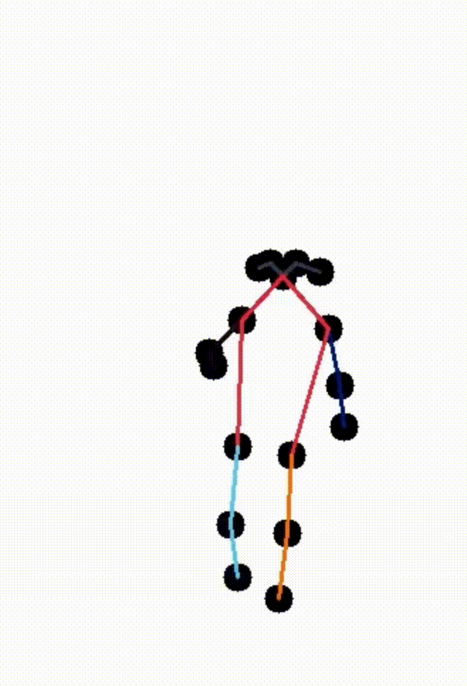

# Gross-motor-performance

This is a source code repository for 'Development of GCN-based deep learning model for early prediction of comprehensive gross motor performance assessment in toddler'.

<!--  -->


# Notice

This code includes the modifications of [pyskl](https://github.com/kennymckormick/pyskl) and [mmaction2](https://github.com/open-mmlab/mmaction2). The specific model used is [CTR-GCN](https://github.com/Uason-Chen/CTR-GCN). 

- Duan, H., Wang, J., Chen, K., & Lin, D. (2022). Pyskl: Towards good practices for skeleton action recognition. In Proceedings of the 30th ACM International Conference on Multimedia (pp. 7351-7354).

- MMAction2 Contributors. (2020). OpenMMLab's Next Generation Video Understanding Toolbox and Benchmark [Computer software]. https://github.com/open-mmlab/mmaction2

- Chen, Y., Zhang, Z., Yuan, C., Li, B., Deng, Y., & Hu, W. (2021). Channel-wise Topology Refinement Graph Convolution for Skeleton-Based Action Recognition. In Proceedings of the IEEE/CVF International Conference on Computer Vision (pp. 13359-13368).


# Installation

```shell
pip install torch==1.10.1+cu102 torchvision==0.11.2+cu102 torchaudio==0.10.1 -f https://download.pytorch.org/whl/cu102/torch_stable.html
```

```shell
git clone https://github.com/suriming/gross-motor-skill-performance.git
pip install openmim
mim install mmcv-full
mim install mmdet
mim install mmpose
pip3 install -e .
pip install -r requirements.txt
```

# Skeleton extraction


To extract skeleton from your custom data, you should use specified conda environment. Refer to the issue 

# 